-----
Partners and Contributions：  
黄乙珂：UCB for each problem, Problem 1, Summary for Problem 5 and Problem 6, assumption for Problem 6.  
朱家怡：TS for each part, Problem 1  
吴羽澄：epsilon-greedy for each part  
-----


## $\textbf{Problem 1}$:

Compute the theoretically maximized  expectation of aggregate rewards over N time slot:

$$
E[\sum^{N}_{t=1}r_{I(t)}]=\sum_{t=1}^{N}E[r_{I(t)}]=\sum_{t=1}^{N}\theta_{I(t)}
$$

So the maximized E will be $\sum_{t=1}^{N}max(\theta_{I(t)})=N*0.7=3500$.

## $\textbf{Problem 2}$:

### (1)$\epsilon$-greedy

```python
import random
import numpy as np
import matplotlib.pyplot as plt
def epsilon_greedy_algorithm(theta, epsilon, N):
    num_arms = len(theta)
    estimated_means = np.zeros(num_arms)  
    arm_counts = np.zeros(num_arms)  
    total_reward = 0
    avg_rewards = []

    for t in range(1, N + 1):
        if np.random.rand() < epsilon:  
            arm = np.random.randint(0, num_arms)
        else:  
            arm = np.argmax(estimated_means)

        reward = 1 if np.random.rand() < theta[arm] else 0

        arm_counts[arm] += 1
        estimated_means[arm] += (reward - estimated_means[arm]) / arm_counts[arm]
        total_reward += reward
        avg_rewards.append(total_reward / t)

    return total_reward, avg_rewards
```

### (2)UCB

```python
def ucb_algorithm(c, N, theta, num_trials=200):
    num_arms = len(theta)
    cumulative_rewards = 0
    rewards_over_time = np.zeros(N)
    for trial in range(num_trials):
        counts = np.zeros(num_arms)
        estimated_theta = np.zeros(num_arms)
        total_reward = 0 
        for t in range(num_arms):
            reward = np.random.binomial(1, theta[t])
            counts[t] += 1
            estimated_theta[t] += reward
            total_reward += reward
            rewards_over_time[t] += total_reward / (t + 1)
        for t in range(num_arms, N):
            ucb_values = estimated_theta + c * np.sqrt(2 * np.log(t + 1) / counts)
            chosen_arm = np.argmax(ucb_values)
            reward = np.random.binomial(1, theta[chosen_arm])
            counts[chosen_arm] += 1
            estimated_theta[chosen_arm] += (reward - estimated_theta[chosen_arm]) / counts[chosen_arm]
            total_reward += reward
            rewards_over_time[t] += total_reward / (t + 1)
        cumulative_rewards += total_reward
    avg_reward = cumulative_rewards / num_trials
    rewards_over_time /= num_trials
    return avg_reward, rewards_over_time
```

### (3)TS

```python
N=5000
trials=200
realTheta = [0.7,0.5,0.4]

def TS(a,b):
    rewardsOverTime = np.zeros(N)
    cumulativeRewards = 0
  
    for trial in range(trials):
        alpha = np.array(a)
        beta = np.array(b)
        totalReward = 0
        for t in range(N):
            theta = [0]*3
            for i in range(3):
                theta[i] = np.random.beta(alpha[i],beta[i])
            I = np.argmax(theta) #选择的arm
            reward = np.random.binomial(1,realTheta[I])
            totalReward += reward
            cumulativeRewards += reward
            alpha[I] = alpha[I]+reward
            beta[I] = beta[I]+1-reward
            rewardsOverTime[t] += totalReward/(t+1)

    return rewardsOverTime/trials, cumulativeRewards/trials
```

## $\textbf{Problem 3}$:

### (1)$\epsilon$-greedy

```python
eps_vals = [0.1, 0.5, 0.9]
N = 5000
trials = 200

accumulated_rewards = np.zeros(3)
rewards_over_time = np.zeros((len(eps_vals), N))

for trial in range(trials):
    for idx, eps in enumerate(eps_vals):
        trial_reward, rewards = epsilon_greedy_algorithm([0.7, 0.5, 0.4], eps, N)
        accumulated_rewards[idx] += trial_reward
        rewards_over_time[idx] += np.array(rewards)

mean_rewards = [round(r/trials, 3) for r in accumulated_rewards]
rewards_over_time /= trials
for i, eps in enumerate(eps_vals):
    print(f"ε = {eps}:")
    print(f"Average reward: {mean_rewards[i]}")
# First plot
plt.figure(figsize=(8, 6))
bar_colors = ['red', 'green', 'blue']
plt.bar(eps_vals, mean_rewards, width=0.1, color=bar_colors)
for eps, reward in zip(eps_vals, mean_rewards):
    plt.text(eps, -200, str(eps), va="bottom", ha="center", fontsize=8)
    plt.text(eps, reward, str(reward), va="bottom", ha="center", fontsize=8)
plt.xlabel('ε')
plt.ylabel('Average Reward (200 Trials)')
plt.ylim([0, 5000])
plt.title('ε-greedy Algorithm Performance')
plt.axhline(y=3500, color='gray', linestyle='--', alpha=0.7)
plt.show()


```

    ε = 0.1:
    Average reward: 3413.99
    ε = 0.5:
    Average reward: 3082.575
    ε = 0.9:
    Average reward: 2751.565

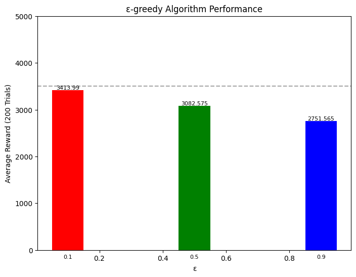

### (2)UCB

```python
N = 5000 
num_trials = 200  
theta = [0.7, 0.5, 0.4] 
c_values = [1, 5, 10] 
avg_rewards = []
rewards_over_time_dict = {}
result_UCB = []
for c in c_values:
    avg_reward, rewards_over_time = ucb_algorithm(c, N, theta, num_trials)
    print("c=",c,"\n Average reward:",avg_reward)
    avg_rewards.append(avg_reward)
    result_UCB.append(avg_reward)
    rewards_over_time_dict[c] = rewards_over_time
  
x = np.arange(len(c_values))
colors = ['r', 'g', 'b']
plt.figure(figsize=(8, 6))
bars = plt.bar(x, avg_rewards, color=colors, width=0.5)
for i, bar in enumerate(bars):
    yval = bar.get_height()
    plt.text(bar.get_x() + bar.get_width() / 2, yval + 50, f"{yval:.2f}", ha='center', va='bottom')
plt.xticks(x, c_values)
plt.xlabel("c")
plt.ylabel("Reward (200 trials)")
plt.title("UCB Algorithm Performance (Average Reward)")
plt.axhline(y=3500, color='gray', linestyle='--', label='Oracle Value (3500)')
plt.ylim(0, 5000)
plt.legend()
plt.show()


```

    c= 1
     Average reward: 3409.52
    c= 5
     Average reward: 2981.095
    c= 10
     Average reward: 2822.9

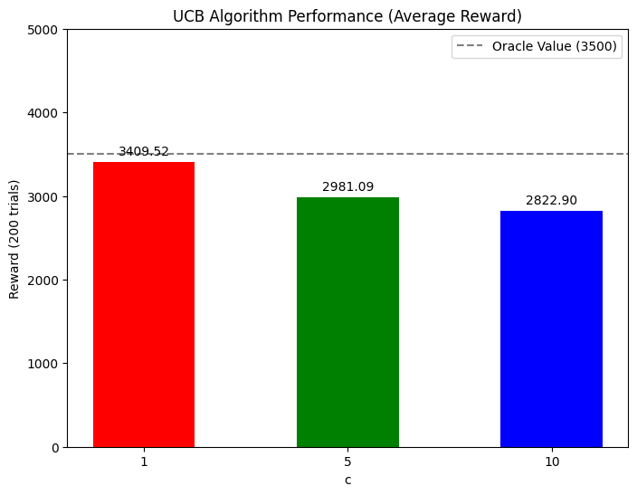

### (3)TS

```python
rewardsOverTime1,averageRewards1 = TS([1,1,1],[1,1,1])
rewardsOverTime2,averageRewards2 = TS([601,401,2],[401,601,3])

averageRewards = [averageRewards1,averageRewards2]
rewardsOverTime = [rewardsOverTime1,rewardsOverTime2]
print(f"α: (1,1,1), β: (1,1,1) ,\n Average reward : {averageRewards1}")
print(f"α: (601,401,2), β: (401,601,3) ,\n Average reward : {averageRewards2}")
#Visulaize results
x = np.arange(2)
colors = ['r','g','b']
plt.figure(figsize=(8, 6))
bars = plt.bar(x, averageRewards, color=colors, width=0.5)
for i, bar in enumerate(bars):
    yval = bar.get_height()
    plt.text(bar.get_x() + bar.get_width() / 2, yval + 50, f"{yval:.2f}", ha='center', va='bottom')
plt.xticks(x, ["case 1","case 2"])
plt.xlabel("Initial Beta Distribution Param")
plt.ylabel("Reward (200 trials)")
plt.title("TS Algorithm Performance (Average Reward)")
plt.axhline(y=3500, color='gray', linestyle='--', label='Oracle Value (3500)')
plt.ylim(0, 5000)
plt.legend()
plt.show()


```

    α: (1,1,1), β: (1,1,1) ,
     Average reward : 3479.46
    α: (601,401,2), β: (401,601,3) ,
     Average reward : 3490.685


## $\textbf{Problem 4}$:

### (1)$\epsilon$-greedy

```python
eps_vals = [0.0000000001,0.00000001,0.00001,0.001,0.05,0.1,0.5,0.9]
N = 5000
trials = 200
oracle_value = 3500  # N * max(theta) = 5000 * 0.7

accumulated_rewards = np.zeros(8)
rewards_over_time = np.zeros((len(eps_vals), N))

# Run experiments
for trial in range(trials):
    for idx, eps in enumerate(eps_vals):
        trial_reward, rewards = epsilon_greedy_algorithm([0.7, 0.5, 0.4], eps, N)
        accumulated_rewards[idx] += trial_reward
        rewards_over_time[idx] += np.array(rewards)

mean_rewards = [round(r/trials, 3) for r in accumulated_rewards]
gaps = [round(oracle_value - reward, 3) for reward in mean_rewards]

print("Results for ε-greedy algorithm:")
for i, eps in enumerate(eps_vals):
    print(f"ε = {eps}:")
    print(f"Average reward: {mean_rewards[i]}")
    print(f"Gap from oracle value: {gaps[i]}")
    print()
# Second plot
plt.figure(figsize=(8, 6))
colors = ['red','green','blue','brown','yellow','purple','orange','grey']
for i, eps in enumerate(eps_vals):
    plt.plot(range(1, N+1), rewards_over_time[i], color=colors[i], label=f'ε={eps}')
plt.xlabel('Time Steps')
plt.ylabel('Average Reward')
plt.title('Rewards Over Time')
plt.legend()
plt.grid(True)
plt.show()

plt.figure(figsize=(10, 6))
bars = plt.bar([str(eps) for eps in eps_vals], mean_rewards, color=colors, width=0.6)
  
for bar, reward in zip(bars, mean_rewards):
    yval = bar.get_height()
    plt.text(bar.get_x() + bar.get_width()/2, yval + 50,
                 f"{int(reward)}", ha='center', va='bottom')
  
plt.axhline(y=3500, color='gray', linestyle='--', label='Oracle Value (3500)')
plt.xlabel("epsilon")
plt.ylabel("Final Total Reward")
plt.title("e-Greedy (Dynamic arm2) Performance at 5000 Steps")
plt.legend()
plt.grid()
plt.show()
```

    Results for ε-greedy algorithm:
    ε = 1e-10:
    Average reward: 3501.605
    Gap from oracle value: -1.605

    ε = 1e-08:
    Average reward: 3498.31
    Gap from oracle value: 1.69

    ε = 1e-05:
    Average reward: 3500.94
    Gap from oracle value: -0.94

    ε = 0.001:
    Average reward: 3499.455
    Gap from oracle value: 0.545

    ε = 0.05:
    Average reward: 3458.025
    Gap from oracle value: 41.975

    ε = 0.1:
    Average reward: 3412.58
    Gap from oracle value: 87.42

    ε = 0.5:
    Average reward: 3081.9
    Gap from oracle value: 418.1

    ε = 0.9:
    Average reward: 2751.235
    Gap from oracle value: 748.765

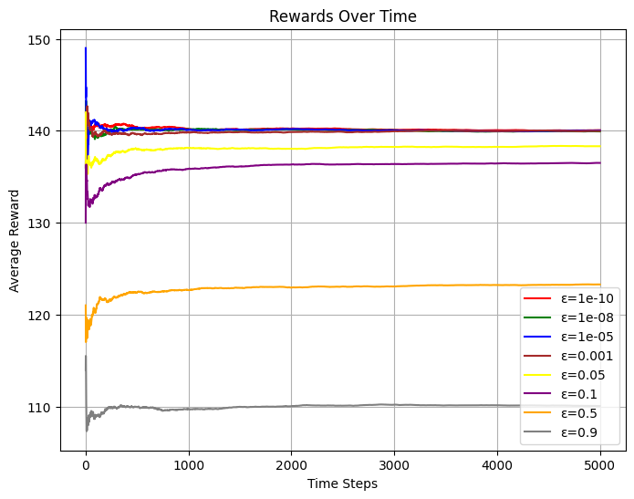

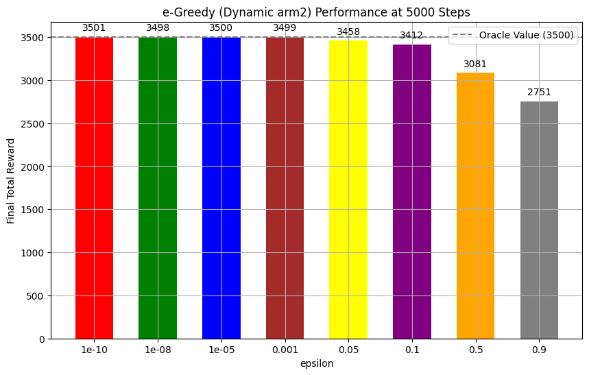

$\textbf{Analysis of ε-greedy algorithm:}$

(i) What does the value of ε mean:

- When ε is small (e.g., 0.00001), the algorithm tends to exploit the current best arm and rarely explores other options
- When ε is medium (e.g., 0.5), the algorithm maintains a balance between exploration and exploitation
- When ε is large (e.g., 1), the algorithm focuses on random exploration and rarely exploits known good options

(ii) Impacts of ε:

- With ε=0.1, from the plot(red line), we can see that the algorithm converges quickly which means it focuses on the arm with highest reward (θ=0.7) quickly, achieving higher cumulative rewards and smallest gap from the oracle value.Comparing their starting point, because in this case the algorithm prefers exploiting, it starts at a high point.
- With ε=0.5, the algorithm balances between exploration and exploitation, but excessive exploration leads to lower convergence speed and lower cumulative rewards compared to ε=0.1(can be seen in green line above).Comparing their starting point, because in this case the algorithm maintains a balance between exploiting and exploration, it starts at a middle point.
- With ε=0.9, the algorithm over-explores arms with lower rewards and rarely exploits the optimal arm, resulting in the lowest convergence speed and the lowest cumulative rewards and largest gap from the oracle value(can be seen in blue line above).Comparing their starting point, because in this case the algorithm prefers exploration, not using the best arm, it starts at the lowest point.

From the experimental results, we can conclude that in this multi-armed bandit problem with fixed reward probabilities, a smaller ε value (0.1) performs best because once the optimal arm is identified, it's more beneficial to exploit it rather than continue excessive exploration.

### (2)UCB

```python
N = 5000 
num_trials = 200  
theta = [0.7, 0.5, 0.4] 
c_values = [0.01,0.1,0.2,0.3,0.5,1,5,10] 
avg_rewards = []
rewards_over_time_dict = {}
result_UCB = []
for c in c_values:
    avg_reward, rewards_over_time = ucb_algorithm(c, N, theta, num_trials)
    print("c=",c,"\n Average reward:",avg_reward)
    avg_rewards.append(avg_reward)
    result_UCB.append(avg_reward)
    rewards_over_time_dict[c] = rewards_over_time
  
x = np.arange(len(c_values))
colors = ['red','green','blue','brown','yellow','purple','orange','grey']
plt.figure(figsize=(8, 6))
bars = plt.bar(x, avg_rewards, color=colors, width=0.5)
for i, bar in enumerate(bars):
    yval = bar.get_height()
    plt.text(bar.get_x() + bar.get_width() / 2, yval + 50, f"{yval:.2f}", ha='center', va='bottom')
plt.xticks(x, c_values)
plt.xlabel("c")
plt.ylabel("Reward (200 trials)")
plt.title("UCB Algorithm Performance (Average Reward)")
plt.axhline(y=3500, color='gray', linestyle='--', label='Oracle Value (3500)')
plt.ylim(0, 5000)
plt.legend()
plt.show()
i = 0
for c in [0.01,0.1,0.2,0.3,0.5,1,5,10]:
    print("When c =",c,"\n the aggragate reward is",result_UCB[i],"\n the gap between result and oracle value is",3500-result_UCB[i],"\n")
    i+=1
plt.figure(figsize=(10, 6))
i = 0
for c in c_values:
    plt.plot(rewards_over_time_dict[c],color=colors[i], label=f"c = {c}")
    i += 1
plt.xlabel("Time Steps")
plt.ylabel("Average Reward")
plt.title("UCB Algorithm: Rewards Over Time")
plt.legend()
plt.grid()
plt.show()
```

    c= 0.01
     Average reward: 3190.625
    c= 0.1
     Average reward: 3165.255
    c= 0.2
     Average reward: 3461.07
    c= 0.3
     Average reward: 3486.89
    c= 0.5
     Average reward: 3474.355
    c= 1
     Average reward: 3415.67
    c= 5
     Average reward: 2983.79
    c= 10
     Average reward: 2828.955

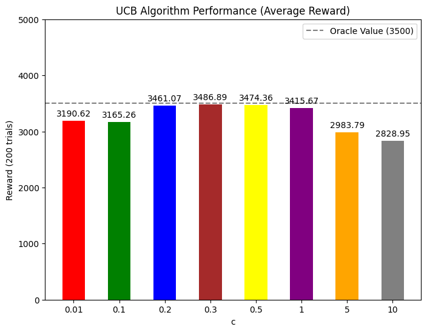

    When c = 0.01
     the aggragate reward is 3190.625
     the gap between result and oracle value is 309.375

    When c = 0.1
     the aggragate reward is 3165.255
     the gap between result and oracle value is 334.7449999999999

    When c = 0.2
     the aggragate reward is 3461.07
     the gap between result and oracle value is 38.929999999999836

    When c = 0.3
     the aggragate reward is 3486.89
     the gap between result and oracle value is 13.110000000000127

    When c = 0.5
     the aggragate reward is 3474.355
     the gap between result and oracle value is 25.644999999999982

    When c = 1
     the aggragate reward is 3415.67
     the gap between result and oracle value is 84.32999999999993

    When c = 5
     the aggragate reward is 2983.79
     the gap between result and oracle value is 516.21

    When c = 10
     the aggragate reward is 2828.955
     the gap between result and oracle value is 671.0450000000001

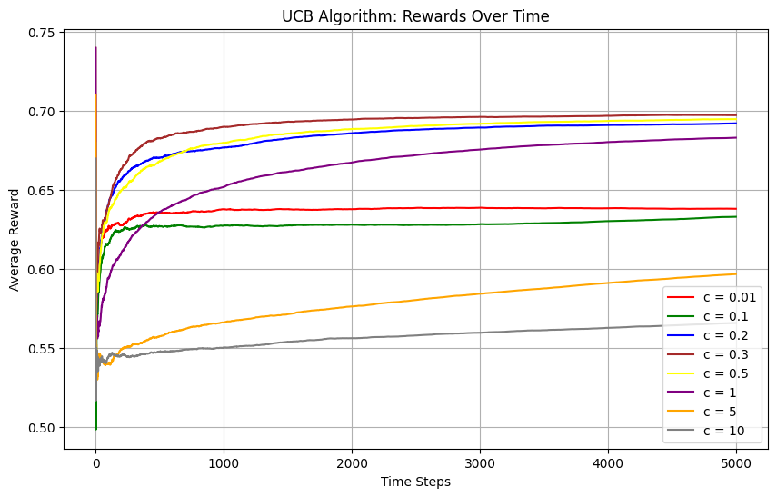

$\textbf{Analysis of UCB algorithm:}$

Extra values for c(0.01,0.1,0.2,0.3,0.5) have been tested to explore the impacts of c.

(i)What does the value of c means?

- When c(e.g., 0.01) is small, it means that the algorithm is less willing to explore other bandits than the bandit which has the highest average reward.
- When c(e.g., 1) is in the middle, it means that the algorithm is willing to maintain the balance between exploring new arms and exploiting the current best arm.
- When c(e.g., 10) is big, it means that the algorithm is more willing to explore other bandits than the current reward-highest bandit.
  From the analysis above we can find out the impacts of c.

(ii)Impacts of c:

- If c is the smallest(0.01), from the plot(the red line), we can see that the time the algorithm costs to converge(reaches to a steady state) will be the smallest and it have made the maximum number of prefered choices getting from the previous results,but this will cause the incorrect judgement of which arm is the best because it hasn't explored enough, thus resulting in a lower result.
- If c is in the middle(0.3), from the plot(the brown line), we find that it costs more time than the former c to find that arm 1 is the best thus converging slower, but this time, it prefered a better choice than the former one because it has explored enough so it can get a best result, having a smallst gap from the oracle value.
- If c is big(10), it may take too much time exploring new arms, so the algorithm's result will be smaller than the former two and its converge speed will be the least(grey line).
  p.s. because the algorithm pulled three arms respectively before starting, there isn't much necessity comparing their starting points, they should be almostly the same.

From the simulation results we can find that in this multi-armed bandit problem with fixed reward probabilities, a middle c value 0.3 performs best among others(0.1,0.2,0.3,0.5,1,5,10) because it can maintain a good balance between exploration and exploitation, which means it can get a more correct information about the reward of three arms while having more time exploiting the best arm's rewards.

### (3)TS

```python
rewardsOverTime3,averageRewards3 = TS([6,4,1],[4,6,1])
rewardsOverTime4,averageRewards4 = TS([6000,4000,20],[4000,6000,30])
rewardsOverTime5,averageRewards5 = TS([500,500,500],[500,500,500])

averageRewards = [averageRewards1,averageRewards2,averageRewards3,averageRewards4,averageRewards5]
rewardsOverTime = [rewardsOverTime1,rewardsOverTime2,rewardsOverTime3,rewardsOverTime4,rewardsOverTime5]

print(f"When α is (1,1,1) and β is (1,1,1)\nThe average reward is {averageRewards1}\nThe gap between the algorithm output and the oracle value is {3500-averageRewards1}\n")
print(f"When α is (601,401,2) and β is (401,601,3)\nThe average reward is {averageRewards2}\nThe gap between the algorithm output and the oracle value is {3500-averageRewards2}\n")
print(f"When α is (6,4,1) and β is (4,6,1)\nThe average reward is {averageRewards3}\nThe gap between the algorithm output and the oracle value is {3500-averageRewards3}\n")
print(f"When α is (6000,4000,20) and β is (4000,6000,30)\nThe average reward is {averageRewards4}\nThe gap between the algorithm output and the oracle value is {3500-averageRewards4}\n")
print(f"When α is (500,500,500) and β is (500,500,500)\nThe average reward is {averageRewards5}\nThe gap between the algorithm output and the oracle value is {3500-averageRewards5}\n")

plt.figure(figsize=(10, 6))
colors = ['red','green','blue','brown','yellow','purple','orange','grey']

for i in range(5):
    plt.plot(rewardsOverTime[i],color=colors[i], label=f"case {i+1}")
plt.xlabel("Time Steps")
plt.ylabel("Average Reward")
plt.title("TS Algorithm: Rewards Over Time")
plt.legend()
plt.grid()
plt.show()
```

    When α is (1,1,1) and β is (1,1,1)
    The average reward is 3479.46
    The gap between the algorithm output and the oracle value is 20.539999999999964

    When α is (601,401,2) and β is (401,601,3)
    The average reward is 3490.685
    The gap between the algorithm output and the oracle value is 9.315000000000055

    When α is (6,4,1) and β is (4,6,1)
    The average reward is 3489.86
    The gap between the algorithm output and the oracle value is 10.139999999999873

    When α is (6000,4000,20) and β is (4000,6000,30)
    The average reward is 3493.0
    The gap between the algorithm output and the oracle value is 7.0

    When α is (500,500,500) and β is (500,500,500)
    The average reward is 3466.705
    The gap between the algorithm output and the oracle value is 33.29500000000007

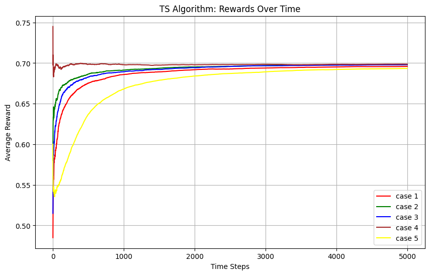

$\textbf{Analysis of TS algorithm:}$

(i)What does the value of $\alpha_j$ and $\beta_j$ means?$\alpha_j$ and $\beta_j$ are the parameters of the Beta distribution used to model the probability of success for arm $j$.

- $\alpha_j$: Represents the number of successes observed for arm $j$. A higher value of $\alpha_j$ indicates that the arm has a higher estimated probability of success.
- $\beta_j$: Represents the number of failures observed for arm $j$. A higher value of $\beta_j$ indicates that the arm has a lower estimated probability of success.

(ii)Impacts of $\alpha_j$ and $\beta_j$:

- If $\alpha_j$ and $\beta_j$ are (1,1), it represents there is no prior knowledge about the success rates of each arm. There is no bias towards any arm initially. There is no bias towards any arm initially.
- If $\alpha_j$ and $\beta_j$ are non-uniform, e.g. ii. $(\alpha_1 = 601, \beta_1 = 401), (\alpha_2 = 401, \beta_2 = 601),(\alpha_3 = 2, \beta_3 = 3)$, it represents there has already been some experiments on these arms or the gambler has a strong assumption on the success rates of each arm.From the plot(green line),it can be seen that the reward is always higher because the algorithm has favored the best arm1(value:0.7). And it has a higher start point because of this correct assumption.
- Large initial parameters will lead to a stable Beta Distribution during the process, reducing random fluctuations, resulting in a fast convergence speed (can be seen from the plot, it reaches to a steady state quickly).
- On the other hand, small initial parameters will be more flexible and be able to explore all arms at the beginning of the process, resulting in a low convergence speed (can be seen from the plot, it reaches to a steady state slowly).

The values of $\alpha_j$ and $\beta_j$ in the TS algorithm significantly impact the balance between exploration and exploitation, the convergence speed, and the initial beliefs about the arms' success probabilities. Adjusting these parameters can tailor the algorithm's performance to specific scenarios.

## $\textbf{Problem 5}$:

### $\textbf{Summary}$:

Exploitation means choosing the arm with current-highest-reward while exploration means trying arms which have been selected for few times. When the rewards of the three arms have not been explored, the best choice is to maintain the balance between exploration and exploitation which means exploring for a period of time and then making good use of the current best arm.

### 1.$\epsilon$-greedy

1. **Exploration**:In the context of the ε-greedy algorithm, exploration means randomly selecting an arm with probability ε. Through exploration, the algorithm can discover potentially high-reward arms and avoid getting stuck in local optima.
2. **Exploitation**:In the ε-greedy algorithm, exploitation means selecting the arm with the highest estimated reward with probability 1-ε. By exploiting, the algorithm aims to maximize immediate rewards based on current knowledge.
3. **Trade-Off**:
   To balance exploration and exploitation, the ε-greedy algorithm uses a simple probability-based approach. The value of ε directly controls this trade-off - smaller ε values favor exploitation while larger ε values favor exploration. The experimental results show that a smaller ε (0.1) performs better in this case as it allows the algorithm to quickly identify and exploit the optimal arm.

### 2.UCB

1. **Exploration**:In the context of the UCB algorithm, exploration means choosing the arm that has been chosen for the least times. By exploring, the algorithm can discover which arms are more likely to yield higher rewards in the long run.
2. **Exploitation**:In the UCB algorithm, exploitation means selecting the arm with the highest reward in the past sampling. By exploiting, the algorithm aims to maximize immediate rewards based on the current knowledge.
3. **Trade-Off**:
   To balance the exploration and exploitation, the UCB algorithm balances exploration and exploitation by favoring arms with high uncertainty in early stages and exploiting more as the number of pulls increases. The smaller the c is, the more the UCB algorithm tends to exploit.

### 3.TS

1. **Exploration**:In the context of the TS algorithm, exploration means sampling from the Beta distribution to estimate the success probabilities of different arms.
2. **Exploitation**:In the TS algorithm, exploitation means selecting the arm with the highest sampled success probability.
3. **Trade-Off**:
   To balance the exploration and exploitation, TS algorithm addresses this trade-off by using a probabilistic approach, where it samples from the Beta distribution to balance exploration and exploitation dynamically. The larger the Beta parameters are, the more the TS algorithm tends to exploit.

## $\textbf{Problem 6}$:

### $\textbf{Assumption}$:

$$
\text{We assume that arm2 and arm1 are dependent but, arm3 is independent on them. }$$ 
$$\text{Let   } P(arm1) \sim Bern(0.7), arm2 = P(arm1)*4/7+(1-P(arm1))*1/3 = 0.5, P(arm3) \sim Bern(0.4)
$$

$$
\text{To use this additional information, we can make the algorithm better respectively. }$$ 
$$\text{By the way, the oracle value is stll 3500. The expectation of each arm \textbf{doesn't change}.}$$ 
$$\text{So we can directly compare the results to the \textbf{results got in the former problems}.}$$   
### $\textbf{Summary of Problem 6}$  
$$\text{The final rewards of \textbf{TS in case 2} and \textbf{UCB at c = 0.3} is the best which is both about \textbf{3492}}
$$

$\text{Among the above three improved algorithms, the improvement of UCB is the most obvious which will get about 148 more rewards when c = 0.1.}$
$\text{TS doesn't perform much improvement because the original results of it are big enough.}$
$\text{The information detect is not a good improvement for greedy because it doesn't feature on exploration as much as the other two algorithms do.}$

### (1)$\epsilon$-greedy

```python
import numpy as np
import matplotlib.pyplot as plt

def e_greedy_with_dynamic_arm2_avg_rewards(num_trials, p_arm1, p_arm3, epsilon=0.1):
    num_arms = 3
    counts = np.zeros(num_arms)   
    rewards = np.zeros(num_arms)   
    cumulative_rewards = np.zeros(num_trials)  

    Q = np.zeros(num_arms)

    for t in range(num_trials):
        if np.random.rand() < (1 - epsilon):
            chosen_arm = np.argmax(Q)
        else:
            chosen_arm = np.random.randint(num_arms)

        p1_hat = Q[0]
        p_arm2_estimated = (4/7)*p1_hat + (1/3)*(1 - p1_hat)
        p_arm2_estimated = np.clip(p_arm2_estimated, 0, 1)  

        if chosen_arm == 0:
            reward = np.random.binomial(1, p_arm1)
        elif chosen_arm == 1:
            reward = np.random.binomial(1, p_arm2_estimated)
        else:
            reward = np.random.binomial(1, p_arm3)

        rewards[chosen_arm] += reward
        counts[chosen_arm] += 1
        Q[chosen_arm] += (reward - Q[chosen_arm]) / counts[chosen_arm]

        cumulative_rewards[t] = np.sum(rewards)

    return cumulative_rewards / (np.arange(num_trials) + 1)


if __name__ == "__main__":
    num_trials = 5000
    num_experiments = 200
    p_arm1, p_arm3 = 0.7, 0.3

    eps_vals = [0.0000000001,0.00000001,0.00001,0.001,0.05,0.1,0.5,0.9]
    avg_rewards_all = np.zeros((len(eps_vals), num_trials))
  
    for idx, eps in enumerate(eps_vals):
        rewards_per_experiment = np.zeros((num_experiments, num_trials))
        for i in range(num_experiments):
            rewards_per_experiment[i] = e_greedy_with_dynamic_arm2_avg_rewards(
                num_trials, p_arm1, p_arm3, epsilon=eps
            )
  
        avg_rewards_all[idx] = np.mean(rewards_per_experiment, axis=0)
  
    plt.figure(figsize=(10, 6))
    colors = ['red','green','blue','brown','yellow','purple','orange','grey']
    for idx, eps in enumerate(eps_vals):
        plt.plot(range(num_trials), avg_rewards_all[idx],
                 color=colors[idx], label=f"epsilon = {eps}")
    plt.xlabel("Time Steps")
    plt.ylabel("Average Reward")
    plt.title("e-Greedy (Dynamic arm2): Rewards Over Time")
    plt.legend()
    plt.grid()
    plt.show()
  

    final_rewards = [avg[-1] * num_trials for avg in avg_rewards_all]

    plt.figure(figsize=(10, 6))
    bars = plt.bar([str(eps) for eps in eps_vals], final_rewards, color=colors, width=0.6)
  
    for bar, reward in zip(bars, final_rewards):
        yval = bar.get_height()
        plt.text(bar.get_x() + bar.get_width()/2, yval + 50,
                 f"{int(reward)}", ha='center', va='bottom')
  
    plt.axhline(y=3500, color='gray', linestyle='--', label='Oracle Value (3500)')
    plt.xlabel("epsilon")
    plt.ylabel("Final Total Reward")
    plt.title("e-Greedy (Dynamic arm2) Performance at 5000 Steps")
    plt.legend()
    plt.grid()
    plt.show()
```

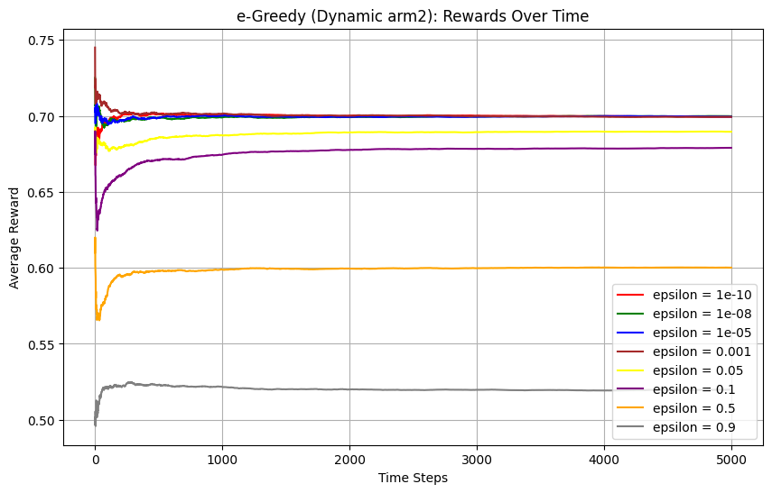

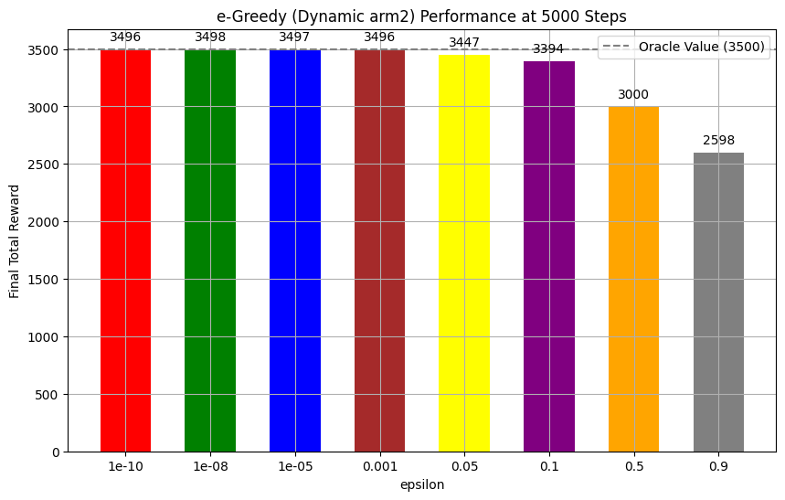

$\textbf{Improvement of the algorithm}$

In the improved version of the $\epsilon$-greedy algorithm, the reward probability of arm 2 is dynamically adjusted based on the observed reward probability of arm 1. This modification is designed to capture the dependency information between arm 1 and arm 2, which is not exploited in the standard $\epsilon$-greedy algorithm. The goal of this adjustment is to encourage more exploration in situations where the dependency between arms may provide additional information to improve the total reward.

$\textbf{The Result}$

From the results shown in the figures:

Average Reward vs. Time Steps: Compared to the standard $\epsilon$-greedy, the rewards in the improved algorithm converge slightly slower, particularly for very small $\epsilon$ values (e.g., $\epsilon = 1e{-10}, 1e{-8},$ etc.). This is because the adjustment encourages exploration, which delays immediate exploitation of the highest estimated reward arm.
Final Rewards for Different $\epsilon$: The modified algorithm shows a different trend in the final rewards as a function of $\epsilon$. While in the original $\epsilon$-greedy, the performance monotonically decreases as $\epsilon$ increases (favoring exploitation), the improved version exhibits a clearer optimal balance. For a specific value of $\epsilon$ (e.g., $\epsilon = 0.05$ in this case), the balance between exploration and exploitation is better, leading to the best performance overall.

$\textbf{Explanation of the Results}$

The $\epsilon$-greedy algorithm primarily focuses on exploitation, as it chooses the best-known arm with a probability of $1-\epsilon$ and explores with a probability of $\epsilon$. In its standard form, increasing $\epsilon$ promotes exploration but sacrifices reward by choosing suboptimal arms more frequently. However, this modification adjusts the reward probability of arm 2 based on the observed success rate of arm 1, which provides additional information for decision-making.

When $\epsilon$ is very small: The algorithm mostly exploits, and the dynamic adjustment of arm 2's probability doesn't significantly improve the results because the algorithm rarely explores. This explains the lower rewards for very small $\epsilon$ values compared to larger ones.

When $\epsilon$ is moderate (e.g., $\epsilon = 0.05$): The balance between exploration and exploitation allows the algorithm to discover the dependency between arm 1 and arm 2 while still exploiting the best-known arm. This achieves the best overall performance, as shown in the second figure.

When $\epsilon$ is large (e.g., $\epsilon = 0.9$): Excessive exploration leads to poor performance because the algorithm spends too much time pulling suboptimal arms, and the dependency information doesn't provide enough benefit to compensate for this.

Dependency Discovery: By dynamically updating the success probability of arm 2 based on arm 1, the improved algorithm better balances exploration and exploitation, especially for intermediate $\epsilon$ values. This adjustment enables the algorithm to detect and utilize the hidden dependency between arms, which standard $\epsilon$-greedy cannot achieve.

$\textbf{Why the Improvement is Limited}$

While the improvement introduces exploration based on dependency information, the $\epsilon$-greedy algorithm inherently struggles with balancing exploration and exploitation due to its simplistic design. The fixed probability $\epsilon$ for exploration is not adaptive over time, which limits the effectiveness of the dependency adjustment. More sophisticated algorithms, like UCB or Thompson Sampling, adaptively adjust exploration based on uncertainty, making them better suited for exploiting such information.

$\textbf{Conclusion}$

The modified algorithm improves the $\epsilon$-greedy strategy by leveraging dependency information, which shifts the optimal $\epsilon$ value and demonstrates better performance at that point. However, due to the intrinsic limitations of the $\epsilon$-greedy framework, the overall improvement remains modest compared to more advanced strategies like UCB or Thompson Sampling.

### (2)UCB

```python
import numpy as np
import matplotlib.pyplot as plt
colors = ['red','green','blue','brown','yellow','purple','orange','grey']
def ucb_with_dynamic_arm2_avg_rewards(num_trials, p_arm1, p_arm3, c, force_explore_rounds=1):
    num_arms = 3
    counts = np.zeros(num_arms)
    rewards = np.zeros(num_arms)
    cumulative_rewards = np.zeros(num_trials)

    for t in range(force_explore_rounds * num_arms):
        arm = t % num_arms
        if arm == 0:
            reward = np.random.binomial(1, p_arm1)
        elif arm == 1:
            reward = np.random.binomial(1, 0.5) 
        else:
            reward = np.random.binomial(1, p_arm3)
        rewards[arm] += reward
        counts[arm] += 1
        cumulative_rewards[t] = np.sum(rewards)

    for t in range(force_explore_rounds * num_arms, num_trials):
        p1_hat = rewards[0] / counts[0]
        p_arm2 = (4 / 7) * p1_hat + (1 / 3) * (1 - p1_hat)
        p_arm2 = np.clip(p_arm2, 0, 1)

        ucb_values = rewards / counts + c * np.sqrt(2 * np.log(t + 1) / counts)
        chosen_arm = np.argmax(ucb_values)

        if chosen_arm == 0:
            reward = np.random.binomial(1, p_arm1)
        elif chosen_arm == 1:
            reward = np.random.binomial(1, p_arm2)
        else:
            reward = np.random.binomial(1, p_arm3)

        rewards[chosen_arm] += reward
        counts[chosen_arm] += 1
        cumulative_rewards[t] = np.sum(rewards)

    return cumulative_rewards / np.arange(1, num_trials + 1)

num_trials = 5000
num_experiments = 200
c_values = [0.01,0.1,0.2,0.3,0.5,1, 5, 10]
p_arm1, p_arm3 = 0.7, 0.3

average_rewards = np.zeros((len(c_values), num_trials))

for idx, c in enumerate(c_values):
    rewards_per_experiment = np.zeros((num_experiments, num_trials))
    for i in range(num_experiments):
        rewards_per_experiment[i] = ucb_with_dynamic_arm2_avg_rewards(num_trials, p_arm1, p_arm3, c)
    average_rewards[idx] = np.mean(rewards_per_experiment, axis=0)

plt.figure(figsize=(10, 6))
for idx, c in enumerate(c_values):
    plt.plot(range(num_trials), average_rewards[idx], color=colors[idx], label=f"c = {c}")

plt.xlabel("Time Steps")
plt.ylabel("Average Reward")
plt.title("UCB Algorithm: Rewards Over Time")
plt.legend()
plt.grid()
plt.show()


final_rewards = [avg[-1] * num_trials for avg in average_rewards]
colors = ['red','green','blue','brown','yellow','purple','orange','grey']
plt.figure(figsize=(10, 6))
bars = plt.bar([str(c) for c in c_values], final_rewards, color=colors, width=0.6)

for bar, reward in zip(bars, final_rewards):
    yval = bar.get_height()
    plt.text(bar.get_x() + bar.get_width() / 2, yval + 50, f"{reward:.2f}", ha='center', va='bottom')

plt.axhline(y=3500, color='gray', linestyle='--', label='Oracle Value (3500)')
plt.xlabel("c (UCB Exploration Parameter)")
plt.ylabel("Final Total Reward")
plt.title("UCB Algorithm Performance at 5000 Steps")
plt.legend()
plt.grid()
plt.show()

gaps = []
for _ in range(len(final_rewards)):
    gaps.append(final_rewards[_]-result_UCB[_])
colors = ['red','green','blue','brown','yellow','purple','orange','grey']
plt.figure(figsize=(10, 6))
bars = plt.bar([str(c) for c in c_values], gaps, color=colors, width=0.6)

for bar,gap in zip(bars, gaps):
    yval = bar.get_height()
    plt.text(bar.get_x() + bar.get_width() / 2, yval + 10, f"{gap:.2f}", ha='center', va='bottom')

plt.xlabel("c (UCB Exploration Parameter)")
plt.ylabel("Improvement")
plt.title("New UCB Algorithm Improvement at 5000 Steps")
plt.grid()
plt.show()

```

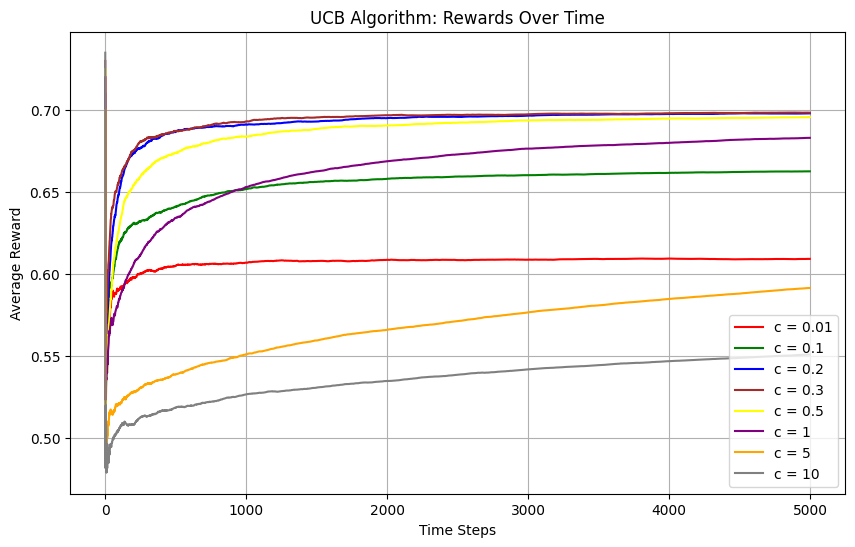

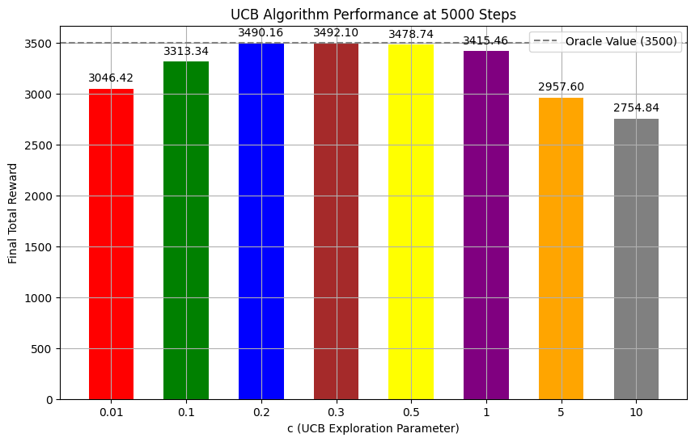

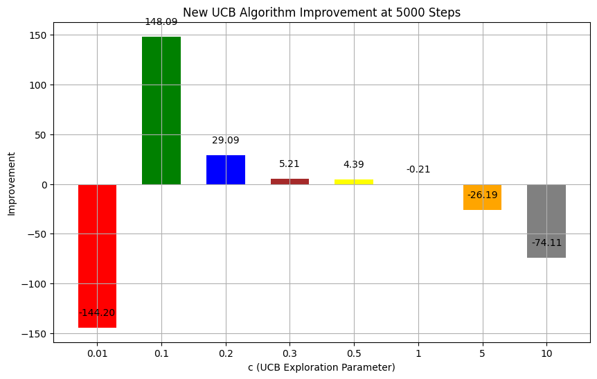

$\textbf{Improvement of the algorithm}$

For UCB, the success probability of arm2 is initially set to 0.5, and it will change with time according to the successful probability of arm1, so that the algorithm can detect the extra dependence information of arm1 and arm2, so the results can get improved.

$\textbf{The Result}$

From the plot we can see that the biggest reward is still when c = 0.3 which is the same as the result in problem 4. This is because that the UCB algorithm maintains the balance between exploration and exploitation by using the experience and favoring the arm with the highest rewards, and when there isn't any additional information in problem 4, the best c indicates the best balance between exploration and exploitation. After the improvement is added, because that the only change is that the new information is added, so the good balance is still the most important thing to get the best reward resulting in the best c's unchanging.

Also, we can see that the large c (e.g. c = 10) doesn't perform well, this is because that the big c focuses on exploiting rather than exploring information, so the largest c may get a worst idea about which arm is a good choice, thus resulting in the lowest reward. Also, the smallest c (e.g. c = 0.01) can get an accurate idea about which arm to push while this may waste too much time thus getting a result worse than c in the middle and it performs even worse when the new information is added.

From the plots above we can see that, comparing with the results under the former assumption, although the theoretical successful probabilities of arms maintain unchanged, the results get improved when c = 0.1,0.2,0.3,0.5 the result maintains about the same when c = 1 and the results get lower in other cases.

$\textbf{Explanation of the results improvement}$

This is because that when c = 0.1,0.2,0.3,0.5, the algorithm can explore the dependent information from the results more, thus getting better results. While for other c values, the improvement can't be seen clearly and there are even worse results because the algorithm can't balance the exploration and the exploitation, so it can't exploit more through the improvement of the information searching.

Because that when c is big, the algorithm focuses more on exploitation, so the decrease of the result won't be the biggest. But when c is small(e.g. when c = 0.01)Because it need to pay even more time than before to explore the new information, the result of it will be the worst among all c values. But, thanks for the accuracy of its explored information, it can get a better rewards then c = 10.

Specifically, when c = 0.2, the improvement can reach about 30, and 0.1 can reach an improvement of about 150. The improvement increases when c is in the middle but smaller than 0.3. This is because that these c focus more on exploration than c = 0.3 thus maintaining better balance between exploration and exploitation when new information is added and still preserve enough time for exploitation.

So, we can say that this improved algorithm can improve the performance.

### (3)TS

```python
import numpy as np
import matplotlib.pyplot as plt

def TS_with_dynamic_arm2_avg_rewards(num_trials, p_arm1, p_arm3, beta_param):
    rewardsOverTime = np.zeros(num_trials)
    cumulativeRewards = 0
  
    a = beta_param[0]
    b = beta_param[1]
    for trial in range(200):
        alpha = np.array(a)
        beta = np.array(b)
        totalReward = 0
        p1_cnt = 0
        for t in range(num_trials):
            theta = [0]*3
            for i in range(3):
                theta[i] = np.random.beta(alpha[i],beta[i])
            if theta[0] > 0.5: 
                theta[1] = 4/7 * theta[0] + 1/3 * (1 - theta[0]) 
            else: 
                theta[1] = 1/3 * theta[0] + 4/7 * (1 - theta[0])
            I = np.argmax(theta) 
            reward = 0
            if I==0:
                reward = np.random.binomial(1,p_arm1)
                p1_cnt+=1
            elif I==2:
                reward = np.random.binomial(1,p_arm3)
            elif I==1:
                p1_hat = p1_cnt / (t+1)
                p_arm2 = (4 / 7) * p1_hat + (1 / 3) * (1 - p1_hat)
                p_arm2 = np.clip(p_arm2, 0, 1)
                reward = np.random.binomial(1,p_arm2)
            totalReward += reward
            cumulativeRewards += reward
            alpha[I] = alpha[I]+reward
            beta[I] = beta[I]+1-reward
            rewardsOverTime[t] += totalReward/(t+1)

    return rewardsOverTime/200, cumulativeRewards/200

num_trials = 5000
num_experiments = 200
p_arm1, p_arm3 = 0.7, 0.3

rewardsOverTime1,averageRewards1 = TS_with_dynamic_arm2_avg_rewards(num_trials, p_arm1, p_arm3, [[1,1,1],[1,1,1]])
rewardsOverTime2,averageRewards2 = TS_with_dynamic_arm2_avg_rewards(num_trials, p_arm1, p_arm3, [[601,401,2],[401,601,3]])

averageRewards = [averageRewards1,averageRewards2]
rewardsOverTime = [rewardsOverTime1,rewardsOverTime2]

plt.figure(figsize=(10, 6))
for i in range(2):
    plt.plot(rewardsOverTime[i],color=colors[i], label=f"case {i+1}")
plt.xlabel("Time Steps")
plt.ylabel("Average Reward")
plt.title("TS Algorithm: Rewards Over Time")
plt.legend()
plt.grid()
plt.show()

#Visulaize results
x = np.arange(2)
colors = ['r','g','b']
plt.figure(figsize=(8, 6))
bars = plt.bar(x, averageRewards, color=colors, width=0.5)
for i, bar in enumerate(bars):
    yval = bar.get_height()
    plt.text(bar.get_x() + bar.get_width() / 2, yval + 50, f"{yval:.2f}", ha='center', va='bottom')
plt.xticks(x, ["case 1","case 2"])
plt.xlabel("Initial Beta Distribution Param")
plt.ylabel("Reward (200 trials)")
plt.title("TS Algorithm Performance (Average Reward)")
plt.axhline(y=3500, color='gray', linestyle='--', label='Oracle Value (3500)')
plt.ylim(0, 5000)
plt.legend()
plt.show()
```

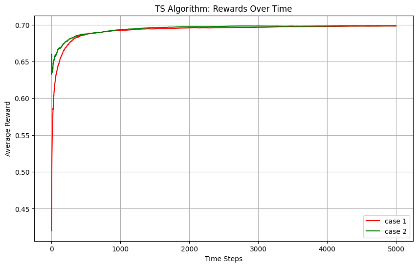

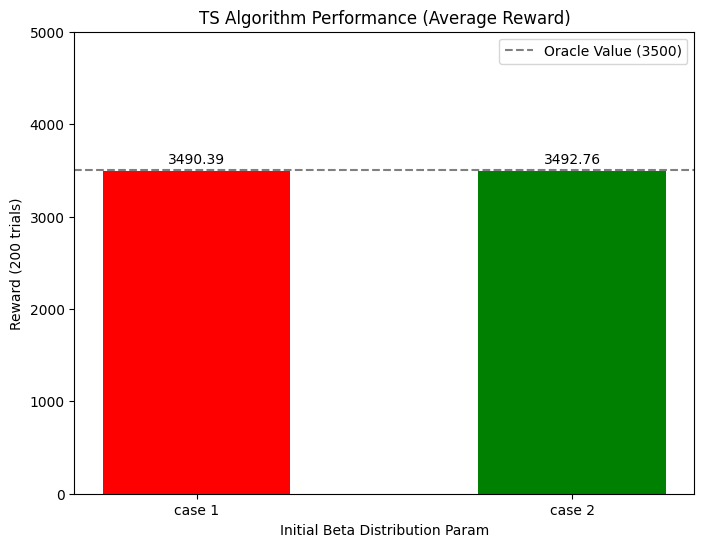

$\textbf{Improvement of the algorithm}$
Because we assume arm1 and arm2 have a dependent relationship $arm2 = P(arm1)*4/7+(1-P(arm1))*1/3 = 0.5$, in each time interval we can update arm2's expectation $\theta$ according to this equation to raise the rate of success.

$\textbf{The Result}$
After we improved the TS (Thompson Sampling) algorithm, the average rewards have shown a slight increase compared to the baseline TS algorithm without considering dependency between arms. Specifically, incorporating the dependency model into the update of arm2's expectation $\theta$ led to more accurate estimations, resulting in more optimal selections over time. Experimental simulations demonstrated that the adjusted TS algorithm achieved higher cumulative rewards within the same time horizon.

$\textbf{Explanation of the results improvement}$
The improvement in results can be attributed to better utilization of the dependency relationship between arms. By incorporating the probabilistic relationship, the algorithm effectively reduces uncertainty and avoids suboptimal exploration.
The Thompson Sampling algorithm relies heavily on the parameters $\alpha$ and $\beta$ of the Beta distribution to balance exploration and exploitation. When prior assumptions are aligned with the actual distribution of rewards, the algorithm converges faster and achieves better performance. The introduction of dependency-based updates for $\theta$ ensures that the priors evolve in a manner consistent with the observed relationships, thus further improving decision quality.

This approach paves the way for more intelligent multi-armed bandit strategies, particularly in domains where interdependencies between options play a critical role.

```python

```
